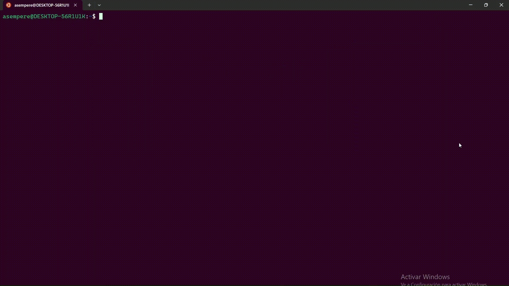

# Ver Anime desde el terminal
[](https://aur.archlinux.org/packages/anicli-esp)
[](https://crates.io/crates/anicli-esp)

Permite ver anime desde el terminal con una interfaz simple e intuitiva. Funciona en todos los sistemas operativos sin dependencias (en WSL se necesita WSLU `sudo apt install wslu`).


```bash
anicli-esp
```

# Instalación
# AUR
Se puede instalar desde el AUR
```bash
yay -Sy anicli-esp
```
## Cargo
Se puede instalar desde cargo
```bash
cargo install anicli-esp
```

# Uso
## Conifgurar
La primera vez que se abre permite elegir que aplicación se utilizará para abrir el video. Esto se puede cambiar mas adelante abriendolo con el argumento --config.
```bash
anicli-esp -c
anicli-esp --config
```
## Interfaz
Con el tabulador y shift + tabulador se puede cambiar la ventana seleccionada. El enter permite selecionar una opción.
## Likes
Con la tecla l pudes añadir un anime a la lista de animes que te gustan. A la cual puedes acceder presionando ctrl+l
